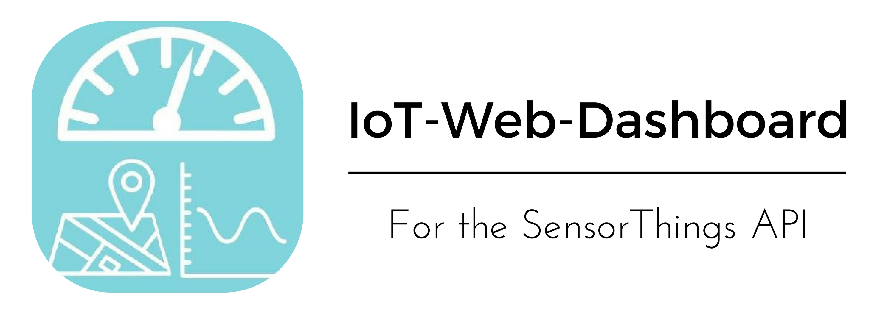

# Introduction

This dashboard provides easy-to-use client-side visualisation of Internet-of-Things sensor data from [OGC SensorThings API](https://github.com/opengeospatial/sensorthings) compatible servers. Various types of widgets can be arranged and configured on the dashboard. It is a web application and can be embedded into any website. 

**Authors:** Simon Böhm, Moritz Grauer, Daniel Liebler, Robin Maisch, Till Stöckmann, Frederic Tausch

# Screenshots

# How to use

A demo of an integration of this dashboard can be found in the [public](https://github.com/IoT-WebDashboard/IoT-WebDashboard) folder. You will still need to download RGraph for this to work (more on this later)!

You need following files and folders:
 - [*iotwebdashboard.js*](https://github.com/IoT-WebDashboard/IoT-WebDashboard) | The code for the dashboard
 - [*iotwebdashboard.css*](https://github.com/IoT-WebDashboard/IoT-WebDashboard) | The style files for the dashboard
 - [*res*](https://github.com/IoT-WebDashboard/IoT-WebDashboard) | The folder containing all images used by the dashboard
 - [*fonts*](https://github.com/IoT-WebDashboard/IoT-WebDashboard) | The folder containing all fonts used by the dashboard. (Not needed if included in your embedded bootstrap)
 
These two files can be found in a release version in the [public](https://github.com/IoT-WebDashboard/IoT-WebDashboard) folder. They have to be imported into the host website after importing the dependencies. 

## Needed Dependencies ##

 - [jQuery & jQueryUI](https://jquery.com) 
 - [Bootstrap](https://getbootstrap.com) (CSS & JS)
 - [Gridstack](https://github.com/troolee/gridstack.js)
 - [lodash](https://lodash.com/) (Needed for Gridstack)
 - [RGraph](https://www.rgraph.net/) (At least common.core, gauge, scatter, line, thermometer, bar)
 - [Leaflet](http://leafletjs.com/)
 - [MQTT.js](https://www.npmjs.com/package/mqtt)
 
As you can see in the demo, there are CDNs for every dependency except RGraph. You will have to download and serve this yourself.

## Embedding the dashboard ##

The dashboard is accessed via the `window.iotDB` variable. 

This variable provides the following functions:
- `create(Object)`: The function to instanciate the dashboard. There should only be one dashboard instance per site. The passed Object can have the following attributes:
    - (required) String `id`: The id of the div tag the dashboard should be created into. The dimensions of the div will not be changed
    - Boolean `disableImportExportCMS`: Disable the user's ability to import/export his dashboard-configuration from/into a CMS
    - Boolean `disableDownloadUpload`: Disable the user's ability to download/upload his dashboard-configuration to/from his local PC
    - Boolean `disableConfiguration`: Disable the user's ability to change the dashboard (including servers, widgets and their placement)
    - Boolean `backgroundTransparent`: Set the background transparent
    - Boolean `enableNoDistraction`: Enable the "no distraction"-mode on startup (removing every part of the dashboard GUI except the widgets)
    - String `baseDir`: The directory to fetch the resources from (*fonts* and *res* folder). Root is the folder of the script
    - String `language`: The language file to be used. Defaults to english. If you want a different language, set up a language file in the public scope with the name passed here. For all missing translations, the english translations will be used. Look at the english language file for all the translations needed
- `onLoad(function)`: The function to be called once the dashboard is all started up
- `onSaveConfig(function)`: The function to be called once the user presses the export button. Here you should export the user's dashboard-config into your CMS
- `onLoadConfig(function)`: The function to be called once the user presses the import button. Here you should import the user's dashboard-config from your CMS

# [Development](https://github.com/IoT-WebDashboard/IoT-WebDashboard) #
